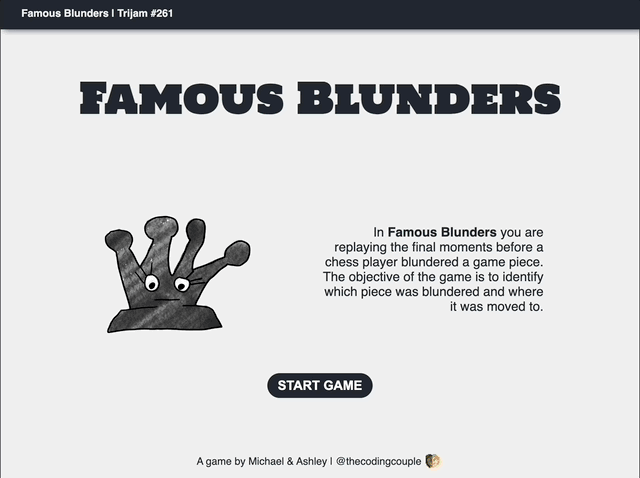

# trijam-261
Source code for our Trijam 261 entry. The theme is "One Wrong Move."

[Trijam](https://itch.io/jam/trijam-261) is a weekly game jam where the goal is to create a game in under 3 hours of development time. We went over the 3 hour goal and spent about 8 hours of active development time in creating the artwork and programming the game.

Try out it out [here](https://thecodingcouple.github.io/trijam-261/)!

## Synopsis

In **Famous Blunders** you are replaying the final moments before a chess player blundered a game piece. The objective of the game is to identify which piece was blundered and where it was moved to. To play the game, players will:

1. Select a square with the game piece to move
2. Select a destination square for the game piece



Artwork hand drawn by our 9 year old!


## Project Setup

Run with local web server

```bash
python -m http.server 8000
```

## Built With

* JavaScript
* Visual Studio Code
* Procreate

## Useful Resources

* [Create checked board pattern in CSS](https://stackoverflow.com/a/941319)

## Third Party Assets 

* [Color Hunt Color Palette](https://colorhunt.co/palette/22283131363f76abaeeeeeee)

## Maintainers

* [Ashley Grenon - @townsean](https://github.com/townsean)
* [Michael Grenon - @nsipid](https://github.com/nsipid)

## License (MIT)

MIT License

Copyright (c) 2024 The Coding Couple

Permission is hereby granted, free of charge, to any person obtaining a copy
of this software and associated documentation files (the "Software"), to deal
in the Software without restriction, including without limitation the rights
to use, copy, modify, merge, publish, distribute, sublicense, and/or sell
copies of the Software, and to permit persons to whom the Software is
furnished to do so, subject to the following conditions:

The above copyright notice and this permission notice shall be included in all
copies or substantial portions of the Software.

THE SOFTWARE IS PROVIDED "AS IS", WITHOUT WARRANTY OF ANY KIND, EXPRESS OR
IMPLIED, INCLUDING BUT NOT LIMITED TO THE WARRANTIES OF MERCHANTABILITY,
FITNESS FOR A PARTICULAR PURPOSE AND NONINFRINGEMENT. IN NO EVENT SHALL THE
AUTHORS OR COPYRIGHT HOLDERS BE LIABLE FOR ANY CLAIM, DAMAGES OR OTHER
LIABILITY, WHETHER IN AN ACTION OF CONTRACT, TORT OR OTHERWISE, ARISING FROM,
OUT OF OR IN CONNECTION WITH THE SOFTWARE OR THE USE OR OTHER DEALINGS IN THE
SOFTWARE.
